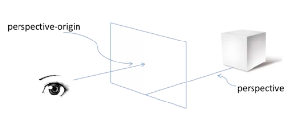
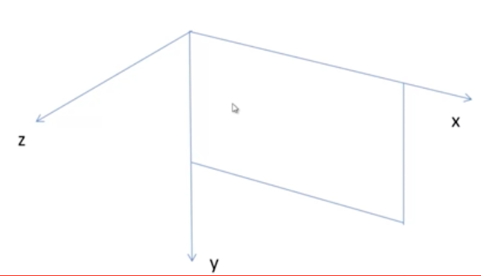

# CSS3 3D特效

### 要点概览
* transition
* 使用 CSS 3.0 创建简单的3D场景
	- perspective；perspective-origin
	- transform：translate，rotate
* 创建3D动画效果

### transition

CSS3中的动画功能主要分别两部分：

* ***transition***（主要用于使元素从一个属性值平滑过渡到另一个属性值）
* animation（支持通过关键帧技术实现复杂效果）

##### 语法

在CSS中添加如下属性：

```
transition:<过渡属性名称> <过渡时间>
```

注意不用浏览器添加不同的前缀：

	-webkit-transition //Chrome,Safari
	-moz-transition    //Firefox
	-o-transition      //Opera

 例如：
 
 * -webkit-transition:color 1s;
 * -webkit-transtion:height 3s;

```
	<head>
		<style>
			#block{
				width:400px;
				height:400px;
				background-color:#69c;
				margin:0 auto;
				-webkit-transition:background-color:3s;
			}
			#block:hover{
				background-color:red;
			}
		</style>
	</head>
	<body>
		<div id="block">
		</div>
	</body>
```

上例在页面中渲染出一个长宽均为400px的蓝色盒子，当鼠标悬停时，会在三秒内变成红色。
	
##### transition效果分析

```
-webkit-transition:color 1s;
```

实际上是两个属性的缩写：

```
-webkit-transition-property:color;
-webkit-transition-duration:1s;
```
* 实现多个属性的过渡效果：
	- 方法1
		* －webkit-transition:<属性1> <时间1>，<属性2> <时间2>， ......
	- 方法2
		* -webkit-transition:<属性1> <时间1>;
		* -webkit-transition:<属性2> <时间2>;

###### 第三个属性值

```
transition:<过渡属性名称> <过渡时间> <过渡模式>
```

也就是

```
transition-timing-function
```

该属性值主要有以下5个：

属性值	   		|对应效果
-------------|-------------
ease 		   |缓慢开始，缓慢结束
linear	  	   |匀速
ease-in	   |缓慢开始
ease-out	   |缓慢结束
ease-in-out  |缓慢开始，缓慢结束（和ease稍有区别）

当不设置该属性值时，其默认值为```ease```，即缓慢开始，缓慢结束。

### 使用CSS3.0创建简单的3D场景

浏览器本身就是一个2D平面，我们需要增加一个维度（深度）使其成为一个3D空间。

设置3D场景：

	-webkit-perspective:800;
	-webkit-perspective-origin:50% 50%;
	


假设左侧视窗为浏览器，也就是看到三维世界的窗口，那么通过浏览器我们就能看到三维物体，那么这个物体到窗口的距离就是perspective表达的意思（在上例中就是800px的距离）；那么人通过窗口观察就存在一个视点的问题，这个视点就是perspective-origin所表达的问题，这里的两个属性值就对应x、y轴的相对位置（上例中50% 50%就对应浏览器的中央）。

### transform

此时浏览器里的物体虽然已经变成三维，但如果没有设置相应属性，和二维效果还是没有区别。所以我们需要使用新属性对元素进行调整。

* 使用transform属性调整元素
	- translate（位移）
		- translateX（x px）
		- translateY（y px）
		- translateZ（z px）
	- rotate（旋转）
		- rotateX（x deg）
		- rotateY（y deg）
		- rotateZ（z deg）

事实上对于transform属性也适用于2D场景，所以为了让浏览器知道我们在三维场景里调整，我们需要增加一条属性。

```-webkit-transform-style:-webkit-preserve-ed;```



这里的x和y构成屏幕坐标系，x正方向为右，y正方向为下；在三维坐标系中多出了一个z轴，其方向就是从屏幕指向我们。

为了更直观地理解三维场景的效果，请欣赏以下demo：

rotate demo：[]()

translate demo:[]()

* 使用transform-origin属性调整旋转中心（默认中心为物体中心）
* x 轴
	- left
	- center
	- right
* y 轴
	- top
	- center
	- bottom
* z 轴
	- length px

### 实践完成一个3D图片翻转

要求：

[默认效果demo]():

[翻书效果demo]():

[翻日历效果demo]():
